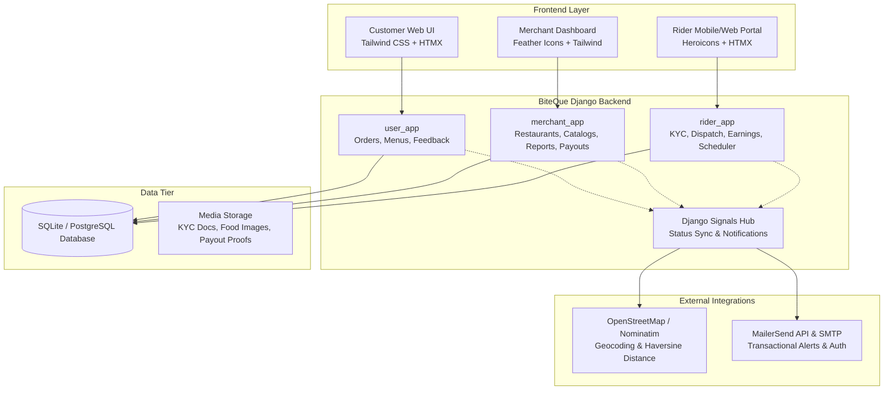
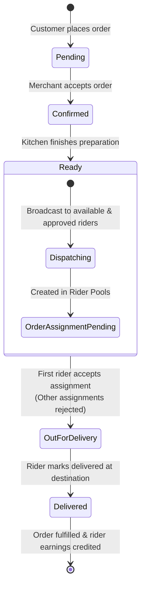

# 🍔 BiteQue

[](https://www.python.org/)
[](https://www.djangoproject.com/)
[](https://tailwindcss.com/)
[](https://htmx.org/)
[]()
[]()

> **BiteQue** is a hyperlocal, three-sided food delivery marketplace connecting **Customers**, **Restaurants (Merchants)**, and **Independent Delivery Riders**, designed specifically for underserved regional markets, starting with Kupwara, Jammu & Kashmir, India.

---

## 📌 Table of Contents

- [Problem & Opportunity](#-problem--opportunity)
- [System Architecture](#-system-architecture)
- [Core User Roles](#-core-user-roles)
- [Order Lifecycle & State Machine](#-order-lifecycle--state-machine)
- [Key Engineering & Design Decisions](#-key-engineering--design-decisions)
  - [1. Preventing Double-Acceptance (Concurrency & Race Conditions)](#1-preventing-double-acceptance-concurrency--race-conditions)
  - [2. Dynamic Rider Pay & Distance Engine](#2-dynamic-rider-pay--distance-engine)
  - [3. Multi-Tier Manual Approval & KYC Verification](#3-multi-tier-manual-approval--kyc-verification)
  - [4. Automated Daily Earnings Reset Daemon](#4-automated-daily-earnings-reset-daemon)
  - [5. Transactional Communications Engine](#5-transactional-communications-engine)
- [Technology Stack](#-technology-stack)
- [Project Directory Structure](#-project-directory-structure)
- [Installation & Local Setup](#-installation--local-setup)
- [Environment Configuration](#-environment-configuration)
- [Product Roadmap & Known Gaps](#-product-roadmap--known-gaps)
- [Authors & Team](#-authors--team)

---

## 💡 Problem & Opportunity

In tier-3 and regional towns like **Kupwara**, national aggregators (Zomato, Swiggy, Blinkit) are not operational. Local restaurants wanting to offer delivery had to either maintain their own dedicated delivery personnel or forgo delivery entirely. Customers were forced to place ad-hoc telephone orders without visibility into menus, delivery timelines, or order tracking.

**BiteQue** bridges this gap:
1. **Customers**: Discover local restaurants, view categorized digital menus, place orders, and track deliveries.
2. **Merchants**: Digitize menus, receive incoming orders, monitor kitchen prep states, and view revenue analytics without needing in-house logistics.
3. **Riders**: Access flexible gig work with transparent distance-based earnings, tiered commissions, and automated daily payouts.
4. **Platform Admins**: Tightly govern the rollout through manual approval gates, verifying KYC credentials, tax details, and payout bank accounts to preserve trust and prevent fraud.

---

## 🏗 System Architecture



---

## 👥 Core User Roles

| Role | Scope & Permissions | Key Capabilities |
| :--- | :--- | :--- |
| **Customer** (`user_app`) | Consumer ordering food | Browse restaurants, explore categorized menus with sizes/pricing, place orders, live-track order progress, submit ratings and reviews. |
| **Merchant** (`merchant_app`) | Restaurant Owner / Manager | Register restaurant with business KYC (PAN, GSTIN, FSSAI), manage menu items, toggle item availability, confirm incoming orders, mark orders ready for pickup, monitor revenue and order history, register bank accounts. |
| **Rider** (`rider_app`) | Delivery gig partner | Register with KYC (Aadhaar front/back, driving license, photo), toggle online availability, review incoming order alerts, accept order assignments, complete deliveries, track daily earnings and request payouts. |
| **Platform Admin** | Superuser & Operations staff | Review and verify merchant profiles, inspect restaurant compliance documents, audit rider KYC proofs, approve payout bank accounts, process payouts. |

---

## 🔄 Order Lifecycle & State Machine

Every order moves through a strict, five-state progression. The transition from `ready` to `out_for_delivery` triggers automatic dispatch across available riders.



---

## ⚙️ Key Engineering & Design Decisions

### 1. Preventing Double-Acceptance (Concurrency & Race Conditions)
When an order reaches `ready`, it is broadcast to all active, approved riders in the area. To ensure two riders cannot accept the same order simultaneously, BiteQue implements a **three-tier defensive strategy**:

1. **Database Constraint (The Final Source of Truth)**:
   ```python
   # rider_app/models.py
   models.UniqueConstraint(
       fields=['order'],
       condition=models.Q(status='accepted'),
       name='unique_accepted_assignment_for_order'
   )
   ```
2. **Atomic Application Rejection in View**:
   When a rider accepts an assignment in `accept_order_assignment`, the view updates that assignment and queries for all competing `pending` assignments for that order, marking them as `rejected`.
3. **Signal Safety Net (`post_save`)**:
   A `post_save` signal on `OrderAssignment` validates state changes. Whenever an assignment switches to `accepted`, the signal independently confirms that other pending assignments are rejected and updates the root `Order.status` to `out_for_delivery`.

---

### 2. Dynamic Rider Pay & Distance Engine

Rider compensation per delivered order is computed dynamically upon delivery:

$$\text{Total Earning} = \text{Distance Earning} + \text{Tiered Commission Earning}$$

#### A. Straight-Line Distance Earning
Coordinates for both the restaurant and the customer delivery destination are automatically geocoded using the **OpenStreetMap Nominatim API** (`geopy`) on save. The straight-line distance is computed via the **Haversine formula**:

$$\text{Distance Earning} = \text{Distance (km)} \times ₹10/\text{km}$$

#### B. Front-Loaded Tiered Commission
Unlike a flat commission model which under-compensates riders on small orders (making short-distance, low-ticket orders unattractive), BiteQue uses an inverted tiered schedule:

| Order Total (₹) | Commission Rate (%) | Rationale |
| :--- | :--- | :--- |
| $\le ₹200$ | **10%** | Guarantees fair compensation on small tickets |
| $₹201 - ₹400$ | **6%** | Balances rider pay and merchant margins |
| $₹401 - ₹1000$ | **4%** | Standard mid-ticket range |
| $₹1001 - ₹2000$ | **2%** | High-ticket orders already yield healthy distance pay |
| $₹2001 - ₹4000$ | **1%** | Tapered rate |
| $> ₹4000$ | **0%** | Capped commission; distance pay covers fulfillment |

---

### 3. Multi-Tier Manual Approval & KYC Verification
In early-stage regional rollouts, risk mitigation and trust outweigh frictionless open onboarding. Every participant must pass manual verification:
- **Merchants & Restaurants**: Monitored via `is_approved`. Admins verify PAN, GSTIN, and FSSAI credentials before restaurants become visible to consumers.
- **Riders**: Identity verified through Aadhaar (front and back copies), driving license number, and photo inspection.
- **Bank Accounts**: Both merchant and rider payout accounts require approval before transfers are executed, preventing fraudulent payout rerouting.

---

### 4. Automated Daily Earnings Reset Daemon
Riders accrue earnings in real time under `today_earnings`. At **midnight (00:00 local time)**, an automated scheduler:
1. Aggregates the day's earnings and completes an entry in `RiderEarning`.
2. Automatically transfers the balance into the rider's `current_balance`.
3. Resets `today_earnings` to ₹0.00.
4. Logs execution metrics to `logs/earnings_reset.log`.

The scheduler runs via a background daemon thread managed by `RiderAppConfig.ready()`, safely bypassing test, migration, and administrative CLI executions.

---

### 5. Transactional Communications Engine
Integrated with **MailerSend** via direct REST endpoints and custom SMTP backend handlers:
- Automated merchant welcome and verification emails.
- Restaurant onboarding status updates.
- Rider approval notifications with branded dynamic templates.
- Password reset workflows for merchants and delivery personnel.

---

## 💻 Technology Stack

- **Backend Framework**: [Django 5.2](https://docs.djangoproject.com/) (Python 3.12 / 3.13)
- **Database**: SQLite (default local development) / PostgreSQL ready
- **Frontend & UI**: HTML5 templates, [Tailwind CSS](https://tailwindcss.com/), [HTMX](https://htmx.org/) (for reactive updates without full page reloads), [Feather Icons](https://feathericons.com/), [Heroicons](https://heroicons.com/)
- **Geolocation & Mapping**: OpenStreetMap Nominatim Geocoding, `geopy`, Haversine Distance computation
- **Email Service Provider**: [MailerSend](https://www.mailersend.com/) (API + Custom Django Email Backend)
- **Image & File Processing**: [Pillow](https://python-pillow.org/)

---

## 📁 Project Directory Structure

```text
BITEQUE/
├── BITEQUE/                     # Project configuration root
│   ├── asgi.py                  # ASGI entrypoint
│   ├── settings.py              # Application settings & third-party configs
│   ├── urls.py                  # Root routing table
│   └── wsgi.py                  # WSGI entrypoint
│
├── user_app/                    # Customer-facing application
│   ├── models.py                # Order, userRegistration, CustomerFeedback, MerchantNotification
│   ├── views.py                 # Menu browsing, order placement, tracking, feedback
│   ├── urls.py                  # Customer routes (/user/, /orders/, etc.)
│   ├── forms.py                 # User signup & feedback forms
│   ├── signals.py               # Auto-broadcast orders on status='ready'
│   └── templates/               # User dashboard, menus, legal pages
│
├── merchant_app/                # Restaurant partner portal
│   ├── models.py                # Restaurant, RestaurantMenu, BankAccount, MerchantEarning, MerchantPayment
│   ├── views.py                 # Merchant dashboard, menu management, order fulfillment, reports
│   ├── urls.py                  # Merchant routes (/merchant-dashboard/, /merchant/orders/, etc.)
│   ├── admin.py                 # Restaurant and KYC verification admin views
│   ├── signals.py               # Merchant onboarding email triggers
│   └── templates/               # Merchant management interfaces
│
├── rider_app/                   # Delivery partner application
│   ├── models.py                # Rider, OrderAssignment, RiderEarning, RiderBankAccount, Transaction
│   ├── views.py                 # Rider login, assignment acceptance, delivery fulfillment, earnings
│   ├── urls.py                  # Rider routes (/dashboard/, /earnings/, etc.)
│   ├── utils.py                 # Haversine distance calculator & geocoding helper
│   ├── signals.py               # Double-acceptance prevention & status cascading
│   ├── mailersend_backend.py    # Custom MailerSend SMTP backend
│   ├── management/commands/     # reset_earnings midnight worker
│   └── templates/               # Rider portal templates
│
├── media/                       # Uploaded files (menu items, KYC scans, payment receipts)
├── static/                      # Static assets (CSS, JS, logos)
├── logs/                        # Application logs (earnings_reset.log)
├── manage.py                    # Django management script
├── requirements.txt             # Project Python dependencies
├── BiteQue_PRD.docx             # Product Requirements Document
└── db.sqlite3                   # Local development database
```

---

## 🚀 Installation & Local Setup

### 1. Prerequisites
- **Python 3.12+** installed on your system
- **Git** (recommended for version control)
- **pip** and `venv`

### 2. Clone or Navigate to the Repository
```bash
cd /path/to/BITEQUE
```

### 3. Create and Activate a Virtual Environment
- **On Windows (PowerShell):**
  ```powershell
  python -m venv venv
  .\venv\Scripts\Activate.ps1
  ```
- **On Linux/macOS:**
  ```bash
  python3 -m venv venv
  source venv/bin/activate
  ```

### 4. Install Dependencies
```bash
pip install -r requirements.txt
```

### 5. Apply Database Migrations
```bash
python manage.py migrate
```

### 6. Create Superuser (Platform Admin)
```bash
python manage.py createsuperuser
```
Follow the prompts to configure an administrator username, email, and password.

### 7. Run the Development Server
```bash
python manage.py runserver
```
Visit `http://127.0.0.1:8000/` in your browser.

---

## 🔐 Environment Configuration

For security best practices, sensitive keys should be stored in environment variables (or a `.env` file). The following parameters are used across `BITEQUE/settings.py`:

```env
# Django Core
SECRET_KEY=your-secure-secret-key
DEBUG=True
ALLOWED_HOSTS=127.0.0.1,localhost

# MailerSend (Merchant & Core)
MAILERSEND_API_KEY=mlsn.your_merchant_api_key
MAILERSEND_DOMAIN=your-merchant-domain.mlsender.net
DEFAULT_FROM_EMAIL=noreply@your-domain.com

# MailerSend (Rider Support & Auth)
MAILERSEND_API_KEY_R=mlsn.your_rider_api_key
MAILERSEND_DOMAIN_R=your-rider-domain.mlsender.net
DEFAULT_FROM_EMAIL_R=noreply@your-domain.com

# SMTP Host Configuration
EMAIL_HOST=smtp.mailersend.net
EMAIL_PORT=587
EMAIL_USE_TLS=True
EMAIL_HOST_USER=your-smtp-user
EMAIL_HOST_PASSWORD=your-smtp-password
```

---

## 🗺 Product Roadmap & Known Gaps

- [ ] **In-App Cart & Checkout**: Implementation of dynamic session-based or database-backed cart with online payment gateway integration (UPI / Razorpay / Cashfree).
- [ ] **Acceptance-Rate Performance Bonus**: Payout logic rewarding riders maintaining a high assignment acceptance rate ($> 85\%$) with weekly bonus top-ups.
- [ ] **Live Rider GPS Tracking**: Real-time Leaflet / Mapbox live location tracking for customers and merchants during `out_for_delivery`.
- [ ] **Settings Hardening**: Full migration of API tokens and credentials to `django-environ` / `.env`.
- [ ] **Automated Password Hashing Migration**: Refactor legacy `userRegistration` fields to rely strictly on Django's cryptographic authentication framework.

---

## 👨‍💻 Authors & Team

BiteQue was architected and developed by:
- **Mohammad Aasif Najar**
- **Shakir Meer**

*Covering local market research, merchant & rider onboarding in Kupwara, J&K, and full-stack engineering.*
